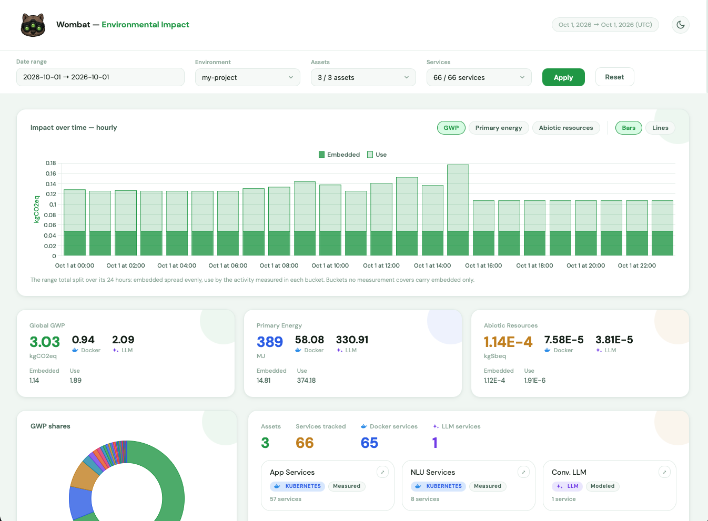
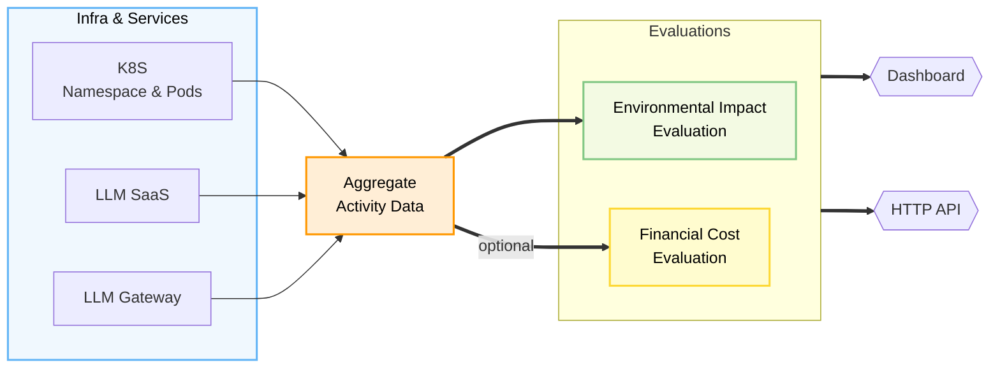
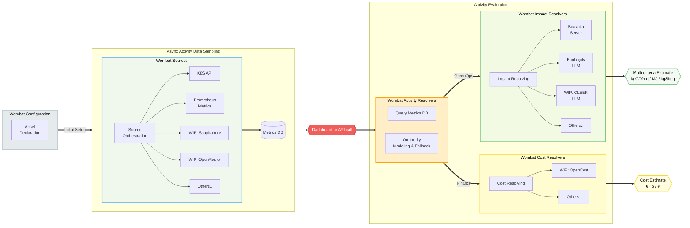

# Wombat Carbon Tracker 

Wombat is a multi-criteria environmental impact tracker for digital and AI services.

Its goal is to streamline the use of astounding work being done by others on environmental footprint calculators, methodology and referential data (namely works from [Boavizta](https://boavizta.org/en), [SustainableAIGroup](https://reports.sustainableaigroup.com/CLEER-Tech-Report/), [Ecologits](https://ecologits.ai)..) and use it where it has the biggest impact:
* at the **_software design stage_**, so as to inform key solution sizing decisions
* after launch, at the **_operations stage_**, so as to inform decision makers on the evolution of their solution's impact

To do that, we focused on a few key ideas:
* a tool that is adaptable regarding **_data sources_**, to make it easier to aggregate quality data, but also offer fallback strategies when that data isn't readily available
* a tool that is **_easy to deploy_**, so as to be able to justify setting it up alongside a lone AI stack, just like it can aggregate data from dozens of different projects in a more centralized fashion
* a tool that **_doesn't reinvent the wheel_**, there are many people working on other challenging parts of the estimation process, so we built a modular system with integrations for calculation engines like Boavizta, Ecologits (and soon CLEER), we also expect to encounter situations where methodology has to be tweaked in one way or another: we built wombat with that in mind
* a tool that tries to **_contextualize ecological impact_** with financial and business metrics: these combined metrics can help paint a complete picture of how much your AI stack costs; _most often_ a large LLM that is costly to use also has a large environmental footprint

In short, Wombat is:
* a Java app (this repository) deployable as [a docker container](https://hub.docker.com/r/illuin/wombat) directly, or on K8S through a [pulumi resource or helm chart](https://github.com/illuin-tech/wombat-k8s)
  * the app exposes a [dashboard](#dashboard) and [HTTP endpoints](#http-api)
* a Java SDK, [wombat-core](https://github.com/illuin-tech/wombat-core), for creating custom modules or directly integrating its core features into other systems

## Dashboard

The Wombat dashboard is accessible at the root path and after running for some time should look something like this:



## HTTP API

Wombat exposes HTTP endpoints, it aims at the same feature coverage in both UI and API so as to enable integration with other tools.

Currently, there are two API hubs:
* `api/impact` is the equivalent of the dashboard but in JSON form, it makes it possible to query active environments and get impact estimations for their services
* `api/simulation` is for getting estimates over entirely manufactured asset descriptions and service activity summary

*Documentation is coming soon™*

## How It Works

Wombat works by doing a few things:
1. **Configuration**: the user provides a set of configurations that will define the scope of the activity to be measured: either through actual data-source connectors (e.g. querying a K8S cluster's metrics API) or through declarative hypothesis
2. **Activity sourcing**: for each of these configurations, if needed, wombat will orchestrate the activation of sources and compile activity metrics into a database
3. **Activity resolving**: when an estimation is requested, it will gather observed and modeled activity metrics for a given time period
4. **Evaluation**: activity data is then submitted to a modular evaluation engine, which will return a standardized multi-criteria impact estimate

_The big picture:_



Each compartment of the engine is modular so as to be extensible. So you can add new ways to:

* source activity data: either for other OSS projects (for which we'll work on expanding in the [core modules](https://github.com/illuin-tech/wombat-core#core-modules) or your own custom-made platform
* estimate activity: this can be done for simulation purposes but also if you need to source data without persisting it into wombat (e.g. this can be a custom DB or API call)
* estimate environmental (or cost) impact: we'll try to have all the main OSS calculators in the core modules, but you can also have your own custom one

_In more details:_



## Documentation

*Documentation is coming soon™*

## How to run

With docker, you can run it as a container like this:

```bash
docker run -p 8080:8080 illuin/wombat
```

### Running with custom configuration

You can override the default configuration and supply your monitored environments by mounting local YAML files into the container:

```bash
docker run -p 8080:8080 \
  -v $(pwd)/application.yaml:/deployments/config/application.yaml:ro \
  -v $(pwd)/monitored-environments.yaml:/deployments/monitored/monitored-environments.yaml:ro \
  illuin/wombat
```

#### Sample `application.yaml` override

Here is an example overriding the connectors to point to local service containers (e.g. running Boavizta and EcoLogits locally) and disabling S3 backups:

```yaml
connector:
  boavizta:
    uri: "http://host.docker.internal:5001/v1/"
  ecologits:
    uri: "http://host.docker.internal:5002/"

backup:
  enabled: false
```

#### Sample `monitored-environments.yaml`

Here is a minimal environment configuration tracking a Kubernetes cluster and an LLM service:

```yaml
environments:
  production:
    id: production
    assets:
      # This type works by querying the kubernetes metrics API and gathering CPU/RAM load factors for each deployed container. 
      - type: tech.illuin.wombat-module.kubernetes-api
        id: prod-cluster
        environment-id: production
        name: Production Cluster
        namespace: my-project-namespace
        config-path: /path/to/kubeconfig
        profile:
          provider: aws
          instance-type: c5.xlarge
          location: FRA
          lifespan: 43800
      # This type works with a request yearly estimate and will prorate it dynamically. 
      # This is the bare minimum available in some situations.
      - type: tech.illuin.wombat-module.llm-static
        id: prod-llm
        environment-id: production
        name: LLM Services
        profile:
          models:
            - provider: mistralai
              model: mistral-large-latest
              location: FRA
              request-profile:
                output-token-count: 500
                request-per-year: 500000
            - provider: openai
              model: mistral-large-latest
              location: SWE
              request-profile:
                output-token-count: 150
                request-per-year: 8000000
```

### Running in dev mode

If you want to run it in dev mode:

```bash
./mvnw quarkus:dev
```

This will require you to have a functional Java 25+ JDK installed on your machine.

### Custom Extensions

Wombat allows user to provide custom modules built with `wombat-core` (see [repository](https://github.com/illuin-tech/wombat-core)) to extend its functionality.

Custom modules (e.g. `wombat-simulator`) are loaded **_at startup_** from every JAR found in `module.extension.path`
(defaults to `extensions`, relative to the working directory, i.e. `app/extensions` when running from `app/`). Override it
with `-Dmodule.extension.path=...` or `MODULE_EXTENSION_PATH=...`.

When starting up the app with a custom extension, you should see logs like these:

```
2026-10-01 16:42:56,837 INFO  [tech.illuin.wombat.module.extension.DynamicExtensionLoader] (Quarkus Main Thread) Loading extensions from /path/to/extensions (1 jar(s))
2026-10-01 16:42:56,839 INFO  [tech.illuin.wombat.module.extension.DynamicExtensionLoader] (Quarkus Main Thread) Discovered extension module tech.illuin.wombat.module.simulator.k8s.KubernetesSimulatorModule for asset-type tech.illuin.wombat-simulator.kubernetes
2026-10-01 16:42:56,839 INFO  [tech.illuin.wombat.module.extension.DynamicExtensionLoader] (Quarkus Main Thread) Discovered extension module tech.illuin.wombat.module.simulator.llm.LLMSimulatorModule for asset-type tech.illuin.wombat-simulator.llm
2026-10-01 16:42:56,839 INFO  [tech.illuin.wombat.module.WombatModuleConfig] (Quarkus Main Thread) Wiring 6 wombat module(s): [KubernetesSimulatedModule, LLMSimulatedModule, LLMStaticModule, KubernetesAPIModule, KubernetesSimulatorModule, LLMSimulatorModule]
```

## How to build

Building the project requires a Java 25+ JDK. You can use the Maven wrapper (`./mvnw`) to compile, test, and package the application:

Compile it:

```bash
./mvnw compile
```

Run all tests:

```bash
./mvnw test
```

Package it (as a .jar in `target/`):

```bash
./mvnw package
```

To package it without running tests, append `-DskipTests`:

```bash
./mvnw package -DskipTests
```

